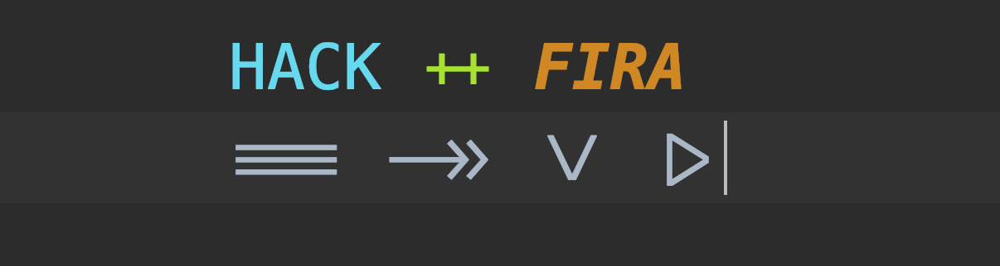

# Ligatured Hack
[](https://travis-ci.com/gaplo917/Ligatured-Hack)
[](https://gitHub.com/gaplo917/Ligatured-Hack/releases/)

<p align="center">
  
</p>

I love Hack font and ligatures.
I can't wait to get latest ligatures with Hack font. 

That's why I build this project with fully automated CI/CD.

|Features|Status|
|-------|:-------:|
|Focus only Hack Font|✅|
|Support [Hack Nerd Font Patches](https://github.com/ryanoasis/nerd-fonts/tree/master/patched-fonts/Hack)|✅|
|Support latest [FIRA Code](https://github.com/tonsky/FiraCode) & [JetBrains Mono](https://github.com/JetBrains/JetBrainsMono)|✅|
|Containerize fontforge and python runtime (Reproducible)|✅|
|Automatically parse [FIRA showcases.txt](https://github.com/tonsky/FiraCode/blob/947ced55552af16f5b01d2ab947e06647dbf064d/showcases/v3/showcases.txt) to update latest ligatures|✅|
|Automatically Build from Travis CI (Hassle-free)|✅|
|Automatically Build if Hack/Fira/JetBrainsMono has new release (Daily Cron)|✅|

Yes! You could ***star*** this repo and ***watch*** the release channel to get the latest Hack + (Fira/JetBrainsMono) Ligatured Font updates!

If you also have a favourite font want to be ligatured, 
you can ***fork*** this repo and make corresponding changes on git submodules & travis ci settings, 
you will benefit from getting hassle free updates of your favourite font!

# Release name explained
The current tag format
```
{HACK_FONT_VERSION}+N{NERD_FONT_VERSION}+FC{FIRA_CODE_FONT_VERSION}+JBM{JETBRAINS_MONO_FONT_VERSION}+{SCRIPT_PATCH_VERSION}

# Abbreviation used
N = Nerd Font
FC = FIRA Code
JBM = JetBrains Mono
CCG = Enabled Copy Character Glyphs
```

# Project History
This repository is forked from [Ligaturizer@daa4dc8b](https://github.com/ToxicFrog/Ligaturizer/tree/daa4dc8baffeefcb27c4ffd30ea52797ead8d123) on 26 Jan 2020. 

At that moment, Ligaturizer was [not able to build latest Hack 3.003 font](https://github.com/ToxicFrog/Ligaturizer/issues/73). I submitted 
a [pull request](https://github.com/ToxicFrog/Ligaturizer/pull/81) to fix that issue. 

However,
* Too many fonts =>
  * Too difficult for me to manually check all the output fonts' correctness.
  * Too difficult to generalize automatic release phases
* No container for development
* Explore more ligatures styling

# Download Ligatured Hack Fonts
Go to [release](https://github.com/gaplo917/Ligatured-Hack/releases)

### Window 10 installation
You have to **right click** the fonts and choose **'install font for all users'**. Otherwise, some IDEs can not be correctly listed the font. 

### Upgrade font version
To upgrade 'Hack Ligatured' version, you are recommended to completely **remove** 'Hack Ligatured' and install it again. Some OS would cache the font until restart.


# Getting Start 
```
# Clone
git clone https://github.com/gaplo917/Ligatured-Hack
cd Ligatured-Hack

# Update Fira, Hack, JetBrains Mono submodules
git submodule update --depth 1 --init --recursive
```

### Manual Build via docker
```
# Build docker image
docker build . -t ligatured-hack

# Mount the volume & Run
docker run -v $(pwd)/fonts/output:/usr/src/app/fonts/output ligatured-hack
```

Done! All the fonts will be built to `$(pwd)/fonts/output`

### Manual Build via MacOS (Not Recommended)
```
# Install fontforge dependencies
brew install fontforge

# Run Makefile
make
```

# More Interesting Stuffs?
If you care about font, you may also care about the color of syntax highlighting. 
I would recommend you can take a look on my other side project [Productivity-oriented color scheme - GapStyle](https://github.com/gaplo917/GapStyle)

# Credits
[Ligaturize](https://github.com/ToxicFrog/Ligaturizer)

[FIRA Code Project](https://github.com/tonsky/FiraCode)

[JetBrains Mono Project](https://github.com/JetBrains/JetBrainsMono)
